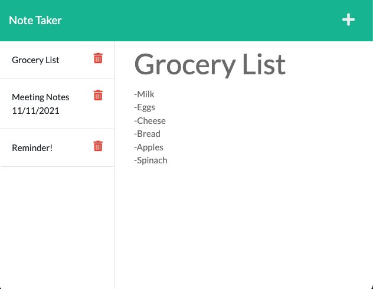

# 📝 noted (built with express and deployed with heroku)
This is a web app to jot down some notes. There is no authentication, so beware that anyone can add or delete your notes!

## Libraries
* node.js
* express
* uuid
* util
* fs
* path

## Concepts Used
* GET, POST, and DELETE HTTP request handling
* Routing
* Web server deployment to Heroku

## Development
* Clone this repo
* Run `npm install`
* Begin developing!

## Tests
There are currently no tests.

## Deployment
This app is deployed to Heroku at this link: https://noted-express.herokuapp.com/notes

To deploy your own, link your github repo to a heroku app and click deploy!
## Usage
Load up the app and add some text to the title and body of your note, then click the save icon. Click on the note to recall it to the main panel. Click the red trash can icon to delete the note.

